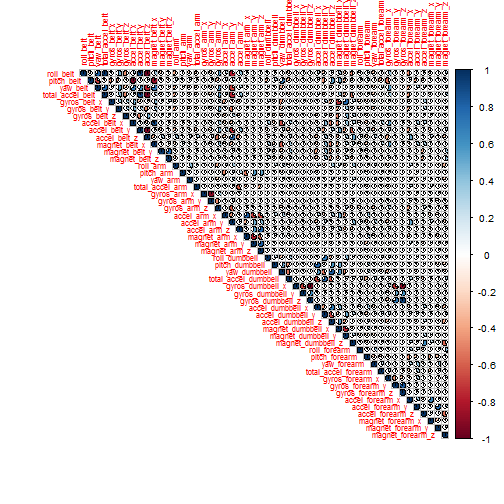
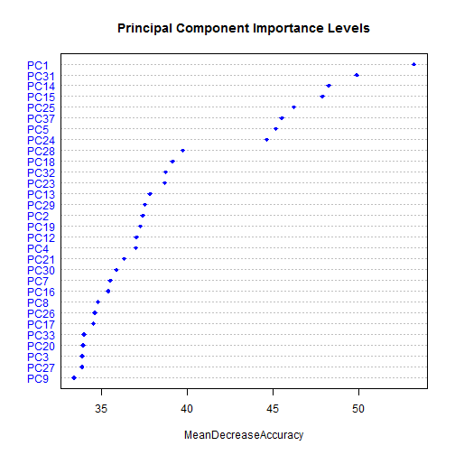

Human Activity Recognition with Random Forest Algorithm
========================================================

#### **Author** : M. Umut DEMiREZEN
#### **Date**   : "Saturday, June 21, 2014"

###Introduction
In this work, human activity data recorded with wearable sensor is used to analyse to classify the movements. HAR data set from  http://groupware.les.inf.puc-rio.br/har is used. This data set contains lots of missing information (empty columns) that has a bad impact for classification. Because of this problem, Data has to be examined carrefully first.

Before we splite the data into training and validation sets, the columns contaning irrilevant information(not sensor measurements), being empty,  consisting of NAs (Not Available strings) has to be removed. After then correlation between the predictors has to be examined not to include highly correlated columns in the validation and training sets. 
After this the predictors the most important for the classification can be selected.

###Investigation of The Data to Obtain Training and Validation Sets

Initially data set includes **160** columns. First Near Zero Variables are investigated. But first data not coming from the sensors and contains the high number of 'NA's and the empty columns are removed to the further operations. These columns may lead to overfitting and other problems. These columns are listed below :

* num_window
* timestamp
* X
* user_name
* new_window
* kurtosis
* skewness
* max_yaw_belt
* min_yaw_belt
* amplitude_yaw_belt
* max_yaw_dumbbell
* min_yaw_dumbbell
* amplitude_yaw_dumbbell
* max_yaw_forearm
* min_yaw_forearm
* amplitude_yaw_forearm

Near Zero Varible calculation result for raw and preprocessed training data is shown below respectively :


```r
library(caret)
library(corrplot)

set.seed(2014)

training <- read.csv("C:/00_Practical Machine Learning/pml-training.csv")
testing <- read.csv("C:/00_Practical Machine Learning/pml-testing.csv")


NAstrainig <- apply(training,2,function(x) {sum(is.na(x))}) 
validData <- training[,which(NAstrainig == 0)]
rIndex <- grep("num_window|timestamp|X|user_name|new_window|kurtosis|skewness|max_yaw_belt|min_yaw_belt|amplitude_yaw_belt|max_yaw_dumbbell|min_yaw_dumbbell|amplitude_yaw_dumbbell|max_yaw_forearm|min_yaw_forearm|amplitude_yaw_forearm",names(validData))
trainData <- validData[,-rIndex]

nzvRaw <- nearZeroVar(training,saveMetrics=TRUE)
print(nzvRaw)
```

```
##                          freqRatio percentUnique zeroVar   nzv
## X                            1.000     100.00000   FALSE FALSE
## user_name                    1.101       0.03058   FALSE FALSE
## raw_timestamp_part_1         1.000       4.26562   FALSE FALSE
## raw_timestamp_part_2         1.000      85.53155   FALSE FALSE
## cvtd_timestamp               1.001       0.10193   FALSE FALSE
## new_window                  47.330       0.01019   FALSE  TRUE
## num_window                   1.000       4.37264   FALSE FALSE
## roll_belt                    1.102       6.77811   FALSE FALSE
## pitch_belt                   1.036       9.37723   FALSE FALSE
## yaw_belt                     1.058       9.97350   FALSE FALSE
## total_accel_belt             1.063       0.14779   FALSE FALSE
## kurtosis_roll_belt        1921.600       2.02324   FALSE  TRUE
## kurtosis_picth_belt        600.500       1.61553   FALSE  TRUE
## kurtosis_yaw_belt           47.330       0.01019   FALSE  TRUE
## skewness_roll_belt        2135.111       2.01305   FALSE  TRUE
## skewness_roll_belt.1       600.500       1.72256   FALSE  TRUE
## skewness_yaw_belt           47.330       0.01019   FALSE  TRUE
## max_roll_belt                1.000       0.99378   FALSE FALSE
## max_picth_belt               1.538       0.11212   FALSE FALSE
## max_yaw_belt               640.533       0.34655   FALSE  TRUE
## min_roll_belt                1.000       0.93772   FALSE FALSE
## min_pitch_belt               2.192       0.08154   FALSE FALSE
## min_yaw_belt               640.533       0.34655   FALSE  TRUE
## amplitude_roll_belt          1.290       0.75426   FALSE FALSE
## amplitude_pitch_belt         3.042       0.06625   FALSE FALSE
## amplitude_yaw_belt          50.042       0.02039   FALSE  TRUE
## var_total_accel_belt         1.427       0.33126   FALSE FALSE
## avg_roll_belt                1.067       0.97340   FALSE FALSE
## stddev_roll_belt             1.039       0.35165   FALSE FALSE
## var_roll_belt                1.615       0.48925   FALSE FALSE
## avg_pitch_belt               1.375       1.09061   FALSE FALSE
## stddev_pitch_belt            1.161       0.21914   FALSE FALSE
## var_pitch_belt               1.308       0.32107   FALSE FALSE
## avg_yaw_belt                 1.200       1.22312   FALSE FALSE
## stddev_yaw_belt              1.694       0.29559   FALSE FALSE
## var_yaw_belt                 1.500       0.73897   FALSE FALSE
## gyros_belt_x                 1.059       0.71348   FALSE FALSE
## gyros_belt_y                 1.144       0.35165   FALSE FALSE
## gyros_belt_z                 1.066       0.86128   FALSE FALSE
## accel_belt_x                 1.055       0.83580   FALSE FALSE
## accel_belt_y                 1.114       0.72877   FALSE FALSE
## accel_belt_z                 1.079       1.52380   FALSE FALSE
## magnet_belt_x                1.090       1.66650   FALSE FALSE
## magnet_belt_y                1.100       1.51870   FALSE FALSE
## magnet_belt_z                1.006       2.32902   FALSE FALSE
## roll_arm                    52.338      13.52563   FALSE FALSE
## pitch_arm                   87.256      15.73234   FALSE FALSE
## yaw_arm                     33.029      14.65702   FALSE FALSE
## total_accel_arm              1.025       0.33636   FALSE FALSE
## var_accel_arm                5.500       2.01305   FALSE FALSE
## avg_roll_arm                77.000       1.68179   FALSE  TRUE
## stddev_roll_arm             77.000       1.68179   FALSE  TRUE
## var_roll_arm                38.500       1.65630   FALSE  TRUE
## avg_pitch_arm               77.000       1.68179   FALSE  TRUE
## stddev_pitch_arm            77.000       1.68179   FALSE  TRUE
## var_pitch_arm               77.000       1.68179   FALSE  TRUE
## avg_yaw_arm                 77.000       1.68179   FALSE  TRUE
## stddev_yaw_arm              80.000       1.66650   FALSE  TRUE
## var_yaw_arm                 40.000       1.65121   FALSE  TRUE
## gyros_arm_x                  1.016       3.27693   FALSE FALSE
## gyros_arm_y                  1.454       1.91622   FALSE FALSE
## gyros_arm_z                  1.111       1.26389   FALSE FALSE
## accel_arm_x                  1.017       3.95984   FALSE FALSE
## accel_arm_y                  1.140       2.73672   FALSE FALSE
## accel_arm_z                  1.128       4.03629   FALSE FALSE
## magnet_arm_x                 1.000       6.82397   FALSE FALSE
## magnet_arm_y                 1.057       4.44399   FALSE FALSE
## magnet_arm_z                 1.036       6.44685   FALSE FALSE
## kurtosis_roll_arm          246.359       1.68179   FALSE  TRUE
## kurtosis_picth_arm         240.200       1.67159   FALSE  TRUE
## kurtosis_yaw_arm          1746.909       2.01305   FALSE  TRUE
## skewness_roll_arm          249.558       1.68688   FALSE  TRUE
## skewness_pitch_arm         240.200       1.67159   FALSE  TRUE
## skewness_yaw_arm          1746.909       2.01305   FALSE  TRUE
## max_roll_arm                25.667       1.47793   FALSE  TRUE
## max_picth_arm               12.833       1.34033   FALSE FALSE
## max_yaw_arm                  1.227       0.25991   FALSE FALSE
## min_roll_arm                19.250       1.41678   FALSE  TRUE
## min_pitch_arm               19.250       1.47793   FALSE  TRUE
## min_yaw_arm                  1.000       0.19366   FALSE FALSE
## amplitude_roll_arm          25.667       1.55947   FALSE  TRUE
## amplitude_pitch_arm         20.000       1.49832   FALSE  TRUE
## amplitude_yaw_arm            1.037       0.25991   FALSE FALSE
## roll_dumbbell                1.022      83.78351   FALSE FALSE
## pitch_dumbbell               2.277      81.22516   FALSE FALSE
## yaw_dumbbell                 1.132      83.14137   FALSE FALSE
## kurtosis_roll_dumbbell    3843.200       2.02834   FALSE  TRUE
## kurtosis_picth_dumbbell   9608.000       2.04362   FALSE  TRUE
## kurtosis_yaw_dumbbell       47.330       0.01019   FALSE  TRUE
## skewness_roll_dumbbell    4804.000       2.04362   FALSE  TRUE
## skewness_pitch_dumbbell   9608.000       2.04872   FALSE  TRUE
## skewness_yaw_dumbbell       47.330       0.01019   FALSE  TRUE
## max_roll_dumbbell            1.000       1.72256   FALSE FALSE
## max_picth_dumbbell           1.333       1.72765   FALSE FALSE
## max_yaw_dumbbell           960.800       0.37203   FALSE  TRUE
## min_roll_dumbbell            1.000       1.69198   FALSE FALSE
## min_pitch_dumbbell           1.667       1.81429   FALSE FALSE
## min_yaw_dumbbell           960.800       0.37203   FALSE  TRUE
## amplitude_roll_dumbbell      8.000       1.97228   FALSE FALSE
## amplitude_pitch_dumbbell     8.000       1.95189   FALSE FALSE
## amplitude_yaw_dumbbell      47.920       0.01529   FALSE  TRUE
## total_accel_dumbbell         1.073       0.21914   FALSE FALSE
## var_accel_dumbbell           6.000       1.95699   FALSE FALSE
## avg_roll_dumbbell            1.000       2.02324   FALSE FALSE
## stddev_roll_dumbbell        16.000       1.99266   FALSE FALSE
## var_roll_dumbbell            8.000       1.97228   FALSE FALSE
## avg_pitch_dumbbell           1.000       2.02324   FALSE FALSE
## stddev_pitch_dumbbell       16.000       1.99266   FALSE FALSE
## var_pitch_dumbbell          16.000       1.99266   FALSE FALSE
## avg_yaw_dumbbell             1.000       2.02324   FALSE FALSE
## stddev_yaw_dumbbell         16.000       1.99266   FALSE FALSE
## var_yaw_dumbbell             8.000       1.97228   FALSE FALSE
## gyros_dumbbell_x             1.003       1.22821   FALSE FALSE
## gyros_dumbbell_y             1.265       1.41678   FALSE FALSE
## gyros_dumbbell_z             1.060       1.04984   FALSE FALSE
## accel_dumbbell_x             1.018       2.16594   FALSE FALSE
## accel_dumbbell_y             1.053       2.37489   FALSE FALSE
## accel_dumbbell_z             1.133       2.08949   FALSE FALSE
## magnet_dumbbell_x            1.098       5.74865   FALSE FALSE
## magnet_dumbbell_y            1.198       4.30129   FALSE FALSE
## magnet_dumbbell_z            1.021       3.44511   FALSE FALSE
## roll_forearm                11.589      11.08959   FALSE FALSE
## pitch_forearm               65.983      14.85577   FALSE FALSE
## yaw_forearm                 15.323      10.14677   FALSE FALSE
## kurtosis_roll_forearm      228.762       1.64102   FALSE  TRUE
## kurtosis_picth_forearm     226.071       1.64611   FALSE  TRUE
## kurtosis_yaw_forearm        47.330       0.01019   FALSE  TRUE
## skewness_roll_forearm      231.518       1.64611   FALSE  TRUE
## skewness_pitch_forearm     226.071       1.62573   FALSE  TRUE
## skewness_yaw_forearm        47.330       0.01019   FALSE  TRUE
## max_roll_forearm            27.667       1.38110   FALSE  TRUE
## max_picth_forearm            2.964       0.78993   FALSE FALSE
## max_yaw_forearm            228.762       0.22933   FALSE  TRUE
## min_roll_forearm            27.667       1.37091   FALSE  TRUE
## min_pitch_forearm            2.862       0.87147   FALSE FALSE
## min_yaw_forearm            228.762       0.22933   FALSE  TRUE
## amplitude_roll_forearm      20.750       1.49322   FALSE  TRUE
## amplitude_pitch_forearm      3.269       0.93263   FALSE FALSE
## amplitude_yaw_forearm       59.677       0.01529   FALSE  TRUE
## total_accel_forearm          1.129       0.35674   FALSE FALSE
## var_accel_forearm            3.500       2.03343   FALSE FALSE
## avg_roll_forearm            27.667       1.64102   FALSE  TRUE
## stddev_roll_forearm         87.000       1.63082   FALSE  TRUE
## var_roll_forearm            43.500       1.60534   FALSE  TRUE
## avg_pitch_forearm           83.000       1.65121   FALSE  TRUE
## stddev_pitch_forearm        41.500       1.64611   FALSE  TRUE
## var_pitch_forearm           41.500       1.63592   FALSE  TRUE
## avg_yaw_forearm             83.000       1.65121   FALSE  TRUE
## stddev_yaw_forearm          85.000       1.64102   FALSE  TRUE
## var_yaw_forearm             42.500       1.63082   FALSE  TRUE
## gyros_forearm_x              1.059       1.51870   FALSE FALSE
## gyros_forearm_y              1.037       3.77637   FALSE FALSE
## gyros_forearm_z              1.123       1.56457   FALSE FALSE
## accel_forearm_x              1.126       4.04648   FALSE FALSE
## accel_forearm_y              1.059       5.11161   FALSE FALSE
## accel_forearm_z              1.006       2.95587   FALSE FALSE
## magnet_forearm_x             1.012       7.76679   FALSE FALSE
## magnet_forearm_y             1.247       9.54031   FALSE FALSE
## magnet_forearm_z             1.000       8.57711   FALSE FALSE
## classe                       1.470       0.02548   FALSE FALSE
```

```r
nzvtrainData <- nearZeroVar(trainData,saveMetrics=TRUE)
print(nzvtrainData)
```

```
##                      freqRatio percentUnique zeroVar   nzv
## roll_belt                1.102       6.77811   FALSE FALSE
## pitch_belt               1.036       9.37723   FALSE FALSE
## yaw_belt                 1.058       9.97350   FALSE FALSE
## total_accel_belt         1.063       0.14779   FALSE FALSE
## gyros_belt_x             1.059       0.71348   FALSE FALSE
## gyros_belt_y             1.144       0.35165   FALSE FALSE
## gyros_belt_z             1.066       0.86128   FALSE FALSE
## accel_belt_x             1.055       0.83580   FALSE FALSE
## accel_belt_y             1.114       0.72877   FALSE FALSE
## accel_belt_z             1.079       1.52380   FALSE FALSE
## magnet_belt_x            1.090       1.66650   FALSE FALSE
## magnet_belt_y            1.100       1.51870   FALSE FALSE
## magnet_belt_z            1.006       2.32902   FALSE FALSE
## roll_arm                52.338      13.52563   FALSE FALSE
## pitch_arm               87.256      15.73234   FALSE FALSE
## yaw_arm                 33.029      14.65702   FALSE FALSE
## total_accel_arm          1.025       0.33636   FALSE FALSE
## gyros_arm_x              1.016       3.27693   FALSE FALSE
## gyros_arm_y              1.454       1.91622   FALSE FALSE
## gyros_arm_z              1.111       1.26389   FALSE FALSE
## accel_arm_x              1.017       3.95984   FALSE FALSE
## accel_arm_y              1.140       2.73672   FALSE FALSE
## accel_arm_z              1.128       4.03629   FALSE FALSE
## magnet_arm_x             1.000       6.82397   FALSE FALSE
## magnet_arm_y             1.057       4.44399   FALSE FALSE
## magnet_arm_z             1.036       6.44685   FALSE FALSE
## roll_dumbbell            1.022      83.78351   FALSE FALSE
## pitch_dumbbell           2.277      81.22516   FALSE FALSE
## yaw_dumbbell             1.132      83.14137   FALSE FALSE
## total_accel_dumbbell     1.073       0.21914   FALSE FALSE
## gyros_dumbbell_x         1.003       1.22821   FALSE FALSE
## gyros_dumbbell_y         1.265       1.41678   FALSE FALSE
## gyros_dumbbell_z         1.060       1.04984   FALSE FALSE
## accel_dumbbell_x         1.018       2.16594   FALSE FALSE
## accel_dumbbell_y         1.053       2.37489   FALSE FALSE
## accel_dumbbell_z         1.133       2.08949   FALSE FALSE
## magnet_dumbbell_x        1.098       5.74865   FALSE FALSE
## magnet_dumbbell_y        1.198       4.30129   FALSE FALSE
## magnet_dumbbell_z        1.021       3.44511   FALSE FALSE
## roll_forearm            11.589      11.08959   FALSE FALSE
## pitch_forearm           65.983      14.85577   FALSE FALSE
## yaw_forearm             15.323      10.14677   FALSE FALSE
## total_accel_forearm      1.129       0.35674   FALSE FALSE
## gyros_forearm_x          1.059       1.51870   FALSE FALSE
## gyros_forearm_y          1.037       3.77637   FALSE FALSE
## gyros_forearm_z          1.123       1.56457   FALSE FALSE
## accel_forearm_x          1.126       4.04648   FALSE FALSE
## accel_forearm_y          1.059       5.11161   FALSE FALSE
## accel_forearm_z          1.006       2.95587   FALSE FALSE
## magnet_forearm_x         1.012       7.76679   FALSE FALSE
## magnet_forearm_y         1.247       9.54031   FALSE FALSE
## magnet_forearm_z         1.000       8.57711   FALSE FALSE
## classe                   1.470       0.02548   FALSE FALSE
```

As it is sen there are no NZVs in the data set. Now it is ready for further investigation. Now we have 52 peredictors and an outcome `classw" for training for now. Next, correlation between the predictors are investigated. Results are shown below,


```r
NAstesting <- apply(testing,2,function(x) {sum(is.na(x))}) 
validDataTesting <- testing[,which(NAstesting == 0)]
rIndex <- grep("num_window|timestamp|X|user_name|new_window|kurtosis|skewness|max_yaw_belt|min_yaw_belt|amplitude_yaw_belt|max_yaw_dumbbell|min_yaw_dumbbell|amplitude_yaw_dumbbell|max_yaw_forearm|min_yaw_forearm|amplitude_yaw_forearm",names(validDataTesting))
testingData <- validDataTesting[,-rIndex]
targetCorrelationInspection <- trainData[,-grep("classe",names(trainData))]
correlationMatrix <- cor(targetCorrelationInspection)
corrplot(correlationMatrix, order = "original", type = "upper",tl.cex = 0.7, method = "pie")
```

 

As seen from the figure, there are lots of correlated predictor both positive and negative manner. So lets find them then decide what to do with. Here are the pedictors with correlation > 0.95,


```r
z <- which((abs(correlationMatrix) > 0.95) & abs(correlationMatrix) < 1, arr.ind=T)
a <- data.frame(rownames(z),colnames(correlationMatrix)[z[,2]])
print("Highly Correlated Predictors: ")
```

```
## [1] "Highly Correlated Predictors: "
```

```r
print(a)
```

```
##         rownames.z. colnames.correlationMatrix..z...2..
## 1  total_accel_belt                           roll_belt
## 2      accel_belt_z                           roll_belt
## 3      accel_belt_x                          pitch_belt
## 4         roll_belt                    total_accel_belt
## 5      accel_belt_z                    total_accel_belt
## 6        pitch_belt                        accel_belt_x
## 7         roll_belt                        accel_belt_z
## 8  total_accel_belt                        accel_belt_z
## 9  gyros_dumbbell_z                    gyros_dumbbell_x
## 10 gyros_dumbbell_x                    gyros_dumbbell_z
```

Correlation matrix shows that `roll_belt` and `total_accel_belt` are highly correlated at least two predictor. There are also other correlated predictors are present. This is unwanted situation. So we can either remove these columns from the data set or we can use principal component analysis to get linearly uncorrelated predictors then use them.

###Principle Component Analysis of The Correlated Predictors

After splitting the proccessed data into training and validation subparts (%75 for training, %25 for validation), PCA used to get linearly uncorrelated predictors. PCA operaion has been applied both training and validation sets also for the final testing.


Lets train a Random Forest Model for this new data set and find out the results. By using trainControl, 4 Fold Cross Correlation is used for resampling. Accuracy based model selection processed to best bodel which was mtry = 2. 


```r
traincontrol <- trainControl(method="cv", number=4)
st <- system.time(modelFit <- train(trainingSet$classe ~ ., method = "rf", data = trainingPC,
                                    trControl = traincontrol,importance = TRUE))
print(st)
```

```
##    user  system elapsed 
##  534.80    1.92  537.48
```

```r
print(modelFit, digits=3)
```

```
## Random Forest 
## 
## 14718 samples
##    36 predictors
##     5 classes: 'A', 'B', 'C', 'D', 'E' 
## 
## No pre-processing
## Resampling: Cross-Validated (4 fold) 
## 
## Summary of sample sizes: 11039, 11038, 11039, 11038 
## 
## Resampling results across tuning parameters:
## 
##   mtry  Accuracy  Kappa  Accuracy SD  Kappa SD
##   2     0.974     0.967  0.00475      0.00601 
##   19    0.973     0.966  0.00338      0.00428 
##   37    0.968     0.96   0.00415      0.00526 
## 
## Accuracy was used to select the optimal model using  the largest value.
## The final value used for the model was mtry = 2.
```

```r
print(modelFit$finalModel,digits=3)
```

```
## 
## Call:
##  randomForest(x = x, y = y, mtry = param$mtry, importance = TRUE) 
##                Type of random forest: classification
##                      Number of trees: 500
## No. of variables tried at each split: 2
## 
##         OOB estimate of  error rate: 1.92%
## Confusion matrix:
##      A    B    C    D    E class.error
## A 4171    6    2    6    0    0.003345
## B   60 2766   19    2    1    0.028792
## C    1   33 2517   10    6    0.019478
## D    6    1   81 2314   10    0.040630
## E    1   10   16   12 2667    0.014412
```

```r
validationResults <- predict(modelFit, validatingPC)
confusionM <- confusionMatrix(validationSet$classe, validationResults)
print(confusionM)
```

```
## Confusion Matrix and Statistics
## 
##           Reference
## Prediction    A    B    C    D    E
##          A 1393    1    0    0    1
##          B   20  922    7    0    0
##          C    1   10  841    3    0
##          D    3    0   43  755    3
##          E    0    2   12    3  884
## 
## Overall Statistics
##                                         
##                Accuracy : 0.978         
##                  95% CI : (0.973, 0.982)
##     No Information Rate : 0.289         
##     P-Value [Acc > NIR] : <2e-16        
##                                         
##                   Kappa : 0.972         
##  Mcnemar's Test P-Value : NA            
## 
## Statistics by Class:
## 
##                      Class: A Class: B Class: C Class: D Class: E
## Sensitivity             0.983    0.986    0.931    0.992    0.995
## Specificity             0.999    0.993    0.997    0.988    0.996
## Pos Pred Value          0.999    0.972    0.984    0.939    0.981
## Neg Pred Value          0.993    0.997    0.985    0.999    0.999
## Prevalence              0.289    0.191    0.184    0.155    0.181
## Detection Rate          0.284    0.188    0.171    0.154    0.180
## Detection Prevalence    0.284    0.194    0.174    0.164    0.184
## Balanced Accuracy       0.991    0.990    0.964    0.990    0.996
```

```r
mA <- postResample(validationSet$classe, validationResults)
modelAccuracy <- mA[[1]]

print("Model Accuracy: ")
```

```
## [1] "Model Accuracy: "
```

```r
print(modelAccuracy,digits=3)
```

```
## [1] 0.978
```

```r
outOfSampleError <- 1 - modelAccuracy
print("Out Of Sample Error")
```

```
## [1] "Out Of Sample Error"
```

```r
print(outOfSampleError,digits=3)
```

```
## [1] 0.0222
```
As seen from the results, `model accuracy is 97.8%` by using postResample operation and `The out of sample error is 2.22%`. these are good results for the estimation of the final testing data. Confusion Matrix of this model is also shown and `OOB estimate of  error rate is 1.92%`. Sensitivity of 98.31% and Specifity of 99.94% scores also obtaing and these are the satisfactory results.

PCA Importance levels of the trained model is also shown the figure below

```r
varImpPlot(modelFit$finalModel, sort = TRUE, type = 1, pch = 18, col = 4, main = "Principal Component Importance Levels")
```

 

After  obtaining the final model with 97.8% accuracy lets find out what is the result for the testing data set...


```r
testingPC <- predict(preProccessing, testingData[, -grep("problem_id",names(testingData))])
predictions <- predict(modelFit,testingPC)
predVector <- as.vector(predictions)
print("Classification Results:")
```

```
## [1] "Classification Results:"
```

```r
print(predVector)
```

```
##  [1] "B" "A" "B" "A" "A" "E" "D" "B" "A" "A" "B" "C" "B" "A" "E" "E" "A"
## [18] "B" "B" "B"
```

With this model, result is `20 out of 20` items successfully classified and the final score is 100%.

###Conclusion

All the testing set data is correctly classified with ramdom forest model through PCA corrected and modified training set. if all the training data was used for training(without cross validation not separating a validation set) the model then the model accuracy would be 99.6%. Under this situation 20/20 correct classificaion was obtained.


